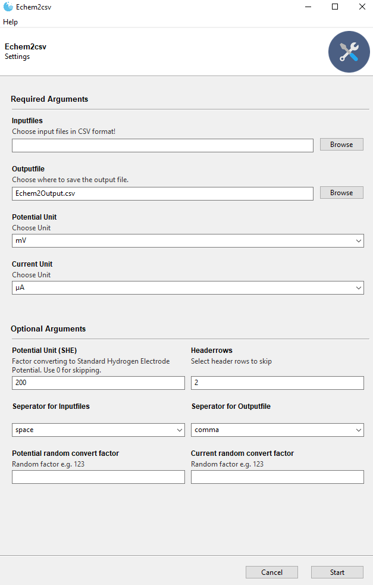

# Echem2csv
- python3 script to combine CSV files
## Required modules

### Command-line

- argparse, textwrap, pandas

### GUI 

- gooey, textwrap, pandas

## Installation

### Command-line

- Execute with python3: `python Echem2csv.py -arguments`
- or change the path to your python3 location in the first line of the script and make it executable (`chmod +x Echem2csv.py`) in bash to run it directly from the shell: `Echem2csv.py -arguments`

### GUI

- Install [Gooey](https://github.com/chriskiehl/Gooey#how-does-it-work) and execute with python3: `python Echem2csvGui.py`
- For Windows10 a standalone .exe file can be alternatively downloaded, where the only difference is the / is a \ in the script.

## Description
- Echem2csv reads CSV files containing two columns.

  Input Sample:

  | Potential (V) | Current (A) |
  | ------------- | ----------- |
  | 0.00123       | 0.00000123  |

  

 - The Potential is converted into mV and can be converted to SHE (Standard Hydrogen Electrode) values. The Current is converted into µA or nA, however a random factor can also be applied.

 - Finally a file is created and all Current columns are combined and saved. The columns header is chosen from the filename. The xAxis or first column with the Potential (mV) is chosen from the first file processed!

 - Output Sample:

   | Potential (mV) / Current (µA) | filename1 | filename* | …    |
   | ----------------------------- | --------- | --------- | ---- |
   | 1.23                          | 1.23      | 1.23      | …    |

     